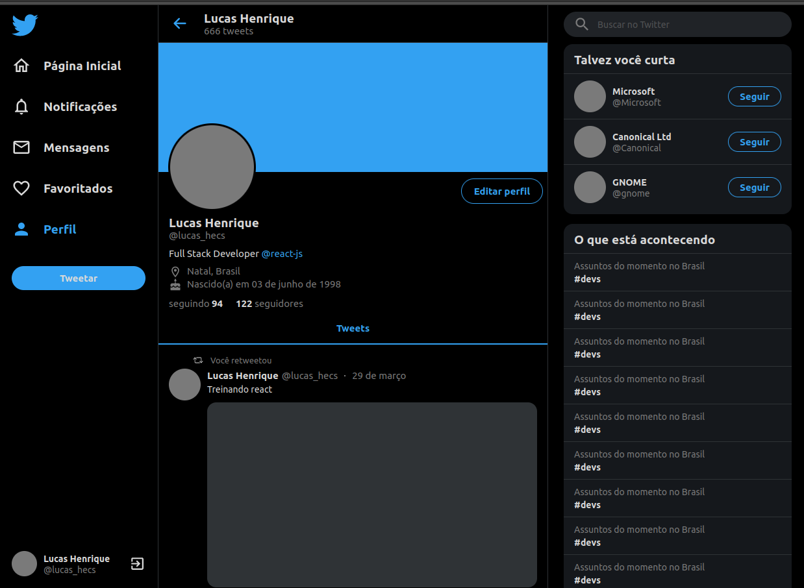
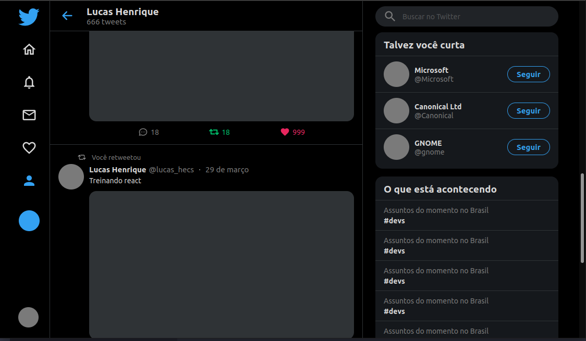
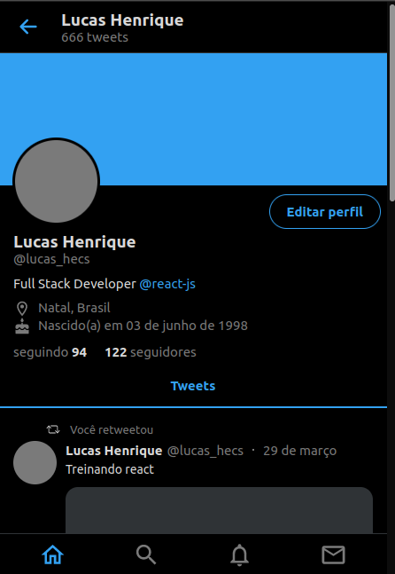

# Twitter Clone UI

Projeto construído com ReactJS para treinar habilidades com a biblioteca, HTML e CSS. Foram aplicados práticas de responsividade para que usuários com diferentes dispositos e tamanhos de tela possam visualizar corretamente a aplicação e ter uma boa experiênica. 

## Novos aprendizados
Uso da lib ``` react-sticky-box``` que expande a forma de funcionamento do ``` position: sticky``` trazando nos possibilidades de efeito com a rolagem da página.

### Insutruções para rodar 
```
npm i
```
Para baixar dependências

```
npm start
```
Para rodar o script que executa a aplicação

## Telas





